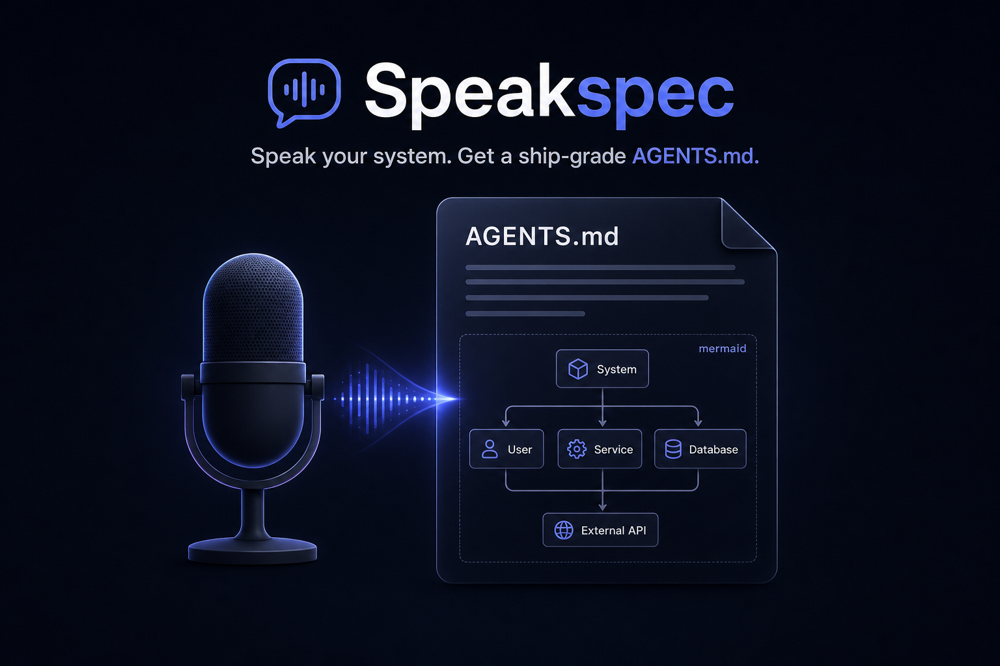

<p align="center">
  
</p>

# Speakspec

**Speak your system for 90 seconds. Get a ship-grade AGENTS.md, architecture spec, ADRs, and diagrams — all local, all private.**

## Quick start

```
1. Install Ollama (https://ollama.com/download) and Speakspec (GitHub Releases)
2. Launch Speakspec — first-run pulls a small model for you
3. Hit Record, describe what you want to build, review, generate
```

<p align="center">
  
  <br/><em>(demo GIF placeholder — full loop: speak → review constraints → streaming pipeline → AGENTS.md + diagrams → paste into Claude Code → scaffolding)</em>
</p>

## What you get

Every session produces a complete, paste-ready bundle:

- **AGENTS.md** — the hero artifact. Lean, command-first, under 200 lines, in the
  cross-tool agent context standard read by Cursor, Codex, Gemini CLI, Windsurf,
  and GitHub Copilot. A quality gate enforces the line cap, build/test/run
  command completeness, and prunes bloat that measurably hurts agent performance.
- **CLAUDE.md** — a one-line `@AGENTS.md` shim for Claude Code. One source of truth.
- **Architecture spec** — opinionated decisions with confidence levels, rationale,
  and ruled-out alternatives. Neutral output is the lowest-value output.
- **ADRs** — one MADR-format file per decision in `docs/adr/`, ready to commit.
- **Five Mermaid diagrams** — sequence, ER, component, C4 context, C4 container —
  run through a validate-and-repair loop against the real Mermaid 11 parser.
- **File tree + first PR definition** — kills the blank-page problem for your
  first agent session.
- **Exports** — Markdown (diagrams inline), DOCX, and full JSON.

## Why local

- **Your unannounced product ideas stay on your machine.** Zero audio, transcript,
  or spec bytes leave it unless you explicitly add a cloud key in settings.
  Zero telemetry. Verify it yourself with Wireshark — the privacy steps are in
  [docs/privacy-verification.md](docs/privacy-verification.md).
- **No subscription, no account, no server.** Transcription runs on
  faster-whisper locally; generation runs on your Ollama models.
- **Model weights are never bundled.** Speakspec pulls them at runtime via
  Ollama, so the installer stays small and license-clean.

## Models supported

| Tier | Models (Apache-2.0 / MIT) | VRAM |
|---|---|---|
| Default | Gemma 4 12B-class Q4, Qwen 3.x 8B | 8 GB |
| Power user | Gemma 4 27B Q4, Qwen 3.x 14B | 16 GB |
| Fast fallback | Phi-4-mini Q4, Gemma 4 4B | 4 GB |

Speakspec detects installed models at runtime and recommends the best one for
your hardware — nothing is hardcoded. ASR uses faster-whisper
`large-v3-turbo` on NVIDIA GPUs and `small.en` on CPU.

## How it works

Three schema-constrained pipeline stages, validated with Pydantic between each:

1. **Constraint extraction** — cleans the transcript, labels every constraint
   `stated` or `inferred`, never invents a language preference, and asks 2–4
   clarifying questions specific to *your* system.
2. **Architecture generation** — chooses the stack on technical fit only
   (your explicit preference overrides and is flagged), prefers mature OSS over
   custom builds, and proactively flags risks you didn't mention.
3. **Output generation** — emits the full bundle, then the Mermaid
   validate-and-repair loop and the AGENTS.md quality gate run before you see it.

## FAQ

**Does it write the code?** No. Speakspec produces the spec and context files;
your AI coding tool does the coding — that's the point.

**Why does it pick the language instead of asking me?** Language familiarity is
no longer a constraint when AI writes the code. Speakspec recommends on
technical fit and tells you what it ruled out. If you state a preference, it's
honored and the tradeoffs are flagged.

**What if a diagram fails to render?** The repair loop fixes most model syntax
errors against the real Mermaid 11 parser; anything unfixable becomes a clean
stub flagged for manual review — never a broken render.

**Windows only?** v1.0 targets Windows 10/11 x64. macOS (MLX path) and Linux
are planned for v1.1.

**Can I use a cloud model?** Optionally, for Stage 3 only, with your own key —
transcript text only, never audio. Off by default.

## Star history

<a href="https://star-history.com/#joseflong/speakspec&Date">
  
</a>

## Contributing

Speakspec is MIT and community-extensible by design — prompt templates
(`templates/presets.json`), the OSS knowledge base
(`templates/oss-knowledge-base.json`), and the tech-vocab dictionary
(`dicts/tech-vocab.json`) are plain JSON: no code changes needed. See
[CONTRIBUTING.md](CONTRIBUTING.md) and the
[Good First Issues](https://github.com/joseflong/speakspec/labels/good%20first%20issue).

## Generated output & copyright

Generated specs, diagrams, and context files are the user's to use freely.
Speakspec claims no ownership over generated output. AI-generated portions may
not be copyrightable under US copyright law absent meaningful human authorship.
Users are responsible for reviewing and taking ownership of generated content
before using it.

## License

MIT — see [LICENSE](LICENSE). Model weights are not bundled and are governed by
their own licenses, pulled at runtime via Ollama.
